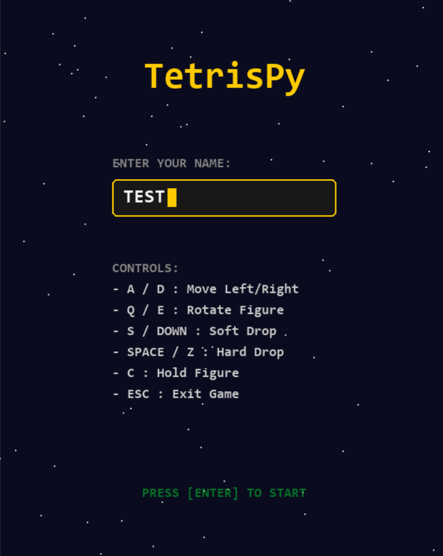
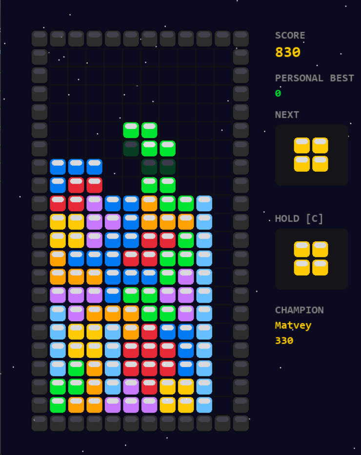
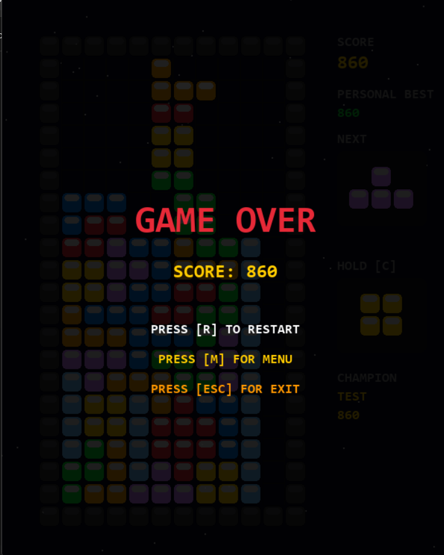

# 🎮 TetrisPy

A modern implementation of the classic **Tetris** game written in **Python** using **Pygame**.

This project was originally developed as a **coursework in C**, and later fully rewritten in Python as a **pet project**
with a focus on **object-oriented programming, clean architecture, and modular design**.

---

## Features

* Classic Tetris gameplay with smooth controls and animations
* **Ghost piece** (landing preview) for better precision
* **Hold piece system** (C key)
* **Dynamic Audio Control:** Custom volume slider for both background music and SFX
* 7-bag randomizer (fair piece generation)
* **Local leaderboard system:**
    * Personal best for each player
    * Local champion (stored in binary file)
* Clean modular OOP architecture

---

## Tech Stack

* Python 3.x
* Pygame

---

## Installation

```bash
git clone https://github.com/dig1tall/TetrisPy.git
cd TetrisPy
pip install -r requirements.txt
```

---

## Run

```bash
python main.py
```

---

## Controls

| Key            | Action            |
|----------------|-------------------|
| A / D          | Move left/right   |
| Q / E          | Rotate            |
| S / ↓          | Soft drop         |
| Space / Z      | Hard drop         |
| C              | Hold piece        |
| **Mouse Drag** | **Adjust Volume** |
| ESC            | Exit game         |

---

## Project Structure

```
Tetris_Realse/
│── main.py
│── README.md
│── requirements.txt
│── .gitignore
│
├── game/
│   │── __init__.py
│   │── engine.py
│   │── board.py
│   │── piece.py
│   │── renderer.py
│   │── score_manager.py
│   │── config.py
│
├── assets/
│   └── sounds/
│
├── scores/
│   ├── champion.dat
│   └── scores.csv
│
├── screenshots/
│   ├── game_over.png
│   ├── gameplay.png
│   └── menu.png
```

---

## Data Storage

* `scores/scores.csv` — stores player scores
* `scores/champion.dat` — stores global best player (binary format)

---

## Architecture

The project follows a modular OOP design:

* `engine.py` — main game loop, event handling, and core logic
* `board.py` — grid management and collision system
* `piece.py` — tetromino behavior and rotation
* `renderer.py` — GUI rendering and **VolumeSlider UI component**
* `score_manager.py` — local data storage (CSV for scores, Binary for champion)
* `config.py` — global constants and color mapping

---

## Screenshots







---

## Future Improvements

* Online leaderboard
* Rebindable controls via config file
* Progressive difficulty levels (speed increase)
* Particle effects for line clearing

---

## License

MIT License

---

## Author

Dovgash Matvey
